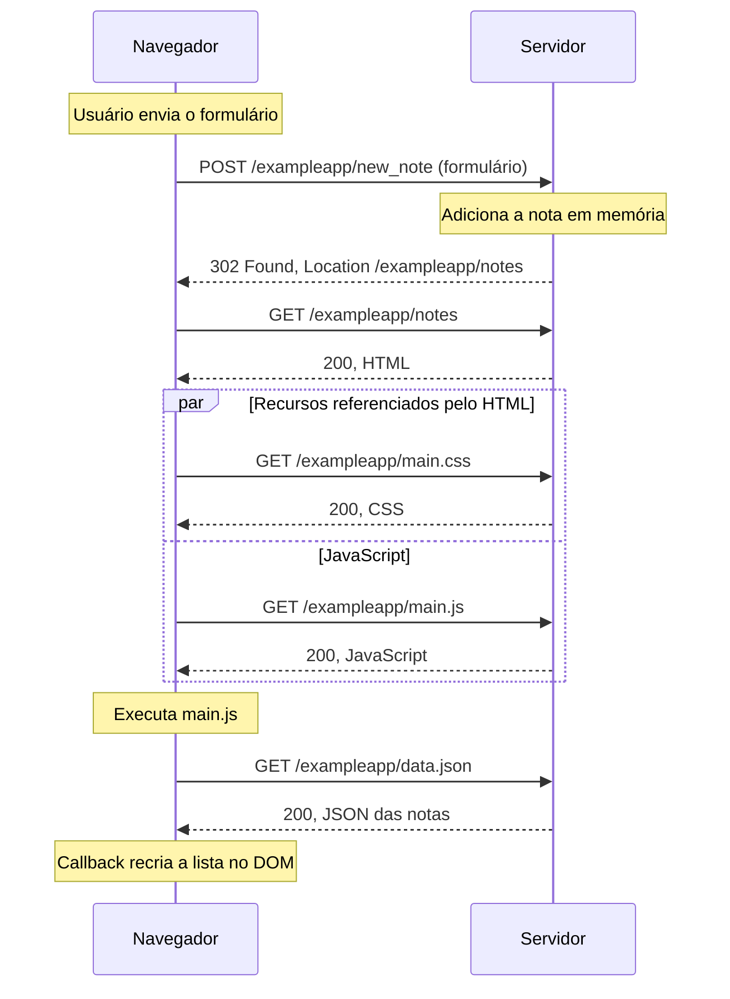

```mermaid
sequenceDiagram
    participant B as Navegador
    participant S as Servidor
    Note over B: Usuário envia o formulário
    B->>S: POST /exampleapp/new_note (formulário)
    Note over S: Adiciona a nota em memória
    S-->>B: 302 Found, Location /exampleapp/notes
    B->>S: GET /exampleapp/notes
    S-->>B: 200, HTML
    par Recursos referenciados pelo HTML
        B->>S: GET /exampleapp/main.css
        S-->>B: 200, CSS
    and JavaScript
        B->>S: GET /exampleapp/main.js
        S-->>B: 200, JavaScript
    end
    Note over B: Executa main.js
    B->>S: GET /exampleapp/data.json
    S-->>B: 200, JSON das notas
    Note over B: Callback recria a lista no DOM
```
