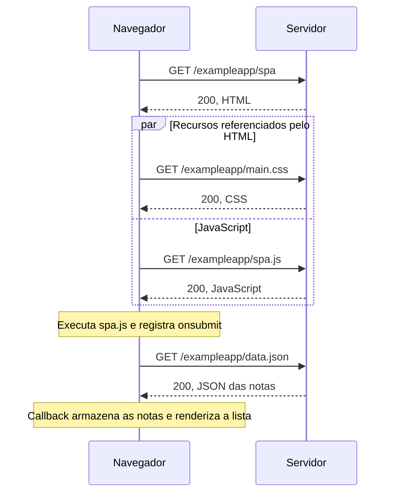

```mermaid
sequenceDiagram
    participant B as Navegador
    participant S as Servidor
    B->>S: GET /exampleapp/spa
    S-->>B: 200, HTML
    par Recursos referenciados pelo HTML
        B->>S: GET /exampleapp/main.css
        S-->>B: 200, CSS
    and JavaScript
        B->>S: GET /exampleapp/spa.js
        S-->>B: 200, JavaScript
    end
    Note over B: Executa spa.js e registra onsubmit
    B->>S: GET /exampleapp/data.json
    S-->>B: 200, JSON das notas
    Note over B: Callback armazena as notas e renderiza a lista
```
