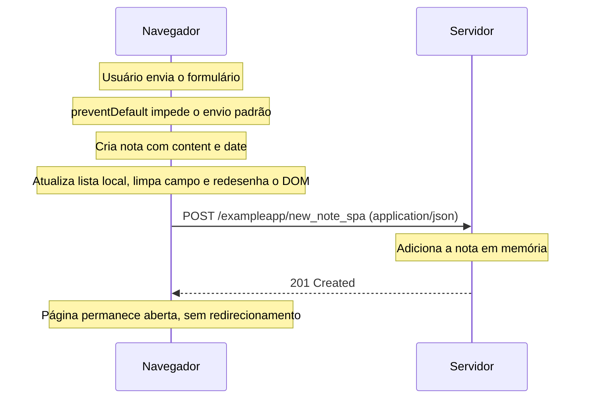

```mermaid
sequenceDiagram
    participant B as Navegador
    participant S as Servidor
    Note over B: Usuário envia o formulário
    Note over B: preventDefault impede o envio padrão
    Note over B: Cria nota com content e date
    Note over B: Atualiza lista local, limpa campo e redesenha o DOM
    B->>S: POST /exampleapp/new_note_spa (application/json)
    Note over S: Adiciona a nota em memória
    S-->>B: 201 Created
    Note over B: Página permanece aberta, sem redirecionamento
```
